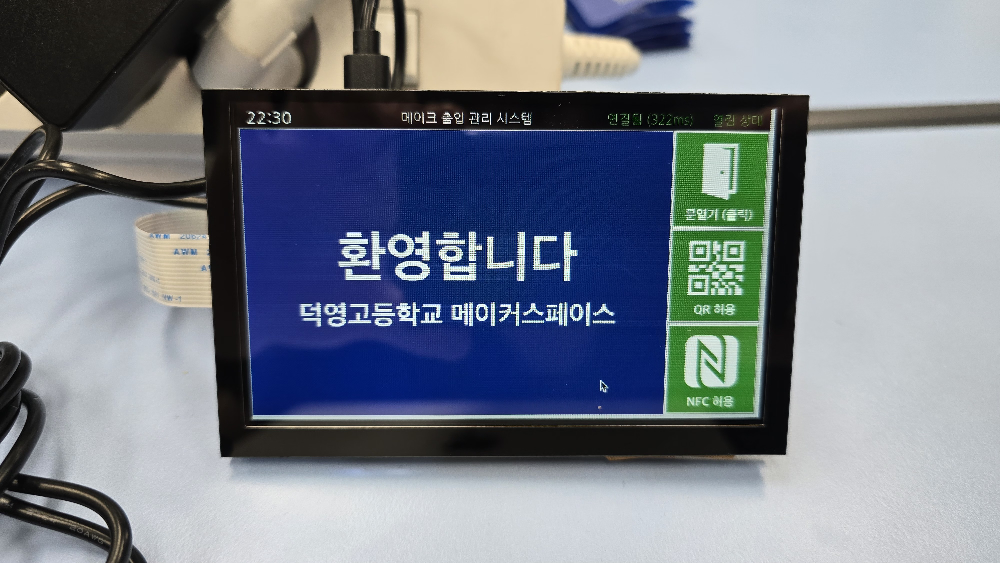

# MAKE; AMS Client(Device)



## Run this script
```bash
sudo apt update; sudo apt upgrade -y;

# reboot permision added
USERNAME="administrator"

USER_HOME=$(eval echo "~$USERNAME")
BASHRC="$USER_HOME/.bashrc"
ALIAS_LINE="alias reboot='sudo /sbin/reboot'"

chown "$USERNAME":"$USERNAME" "$BASHRC"

# Font
sudo apt install fonts-nanum

# NFC
sudo raspi-config  # -> Interface Options -> I2C -> Enable
sudo apt-get install i2c-tools
i2cdetect -y 1     # PN532가 0x24, 0x48, 0x68 등으로 보여야 함

# etc...
sudo usermod -aG input administrator
sudo apt-get install python3-evdev
sudo systemctl disable bluetooth.service
sudo systemctl disable hciuart.service
sudo systemctl disable avahi-daemon.service
sudo systemctl disable cups.service
sudo apt remove rpi-connect -y

```